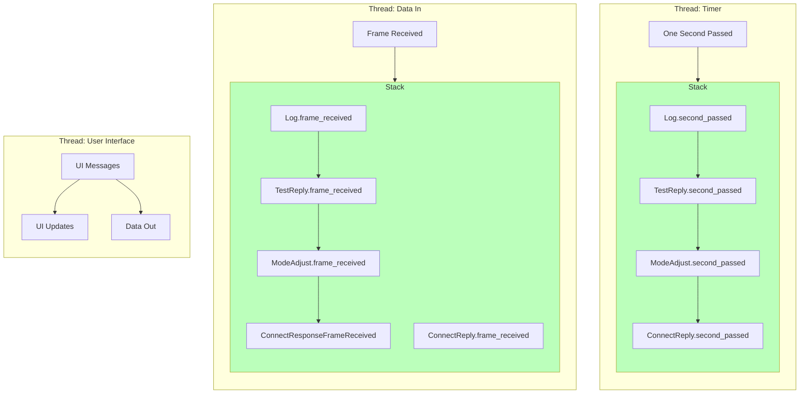

# NetTerm

NetTerm is an amateur radio terminal client for KISS TNCs with support for changing operating modes on the NinoTNC.
This means NetTerm can negiotiate the fastest protocol between two stations and communicate using that protocol.

## Navigation

In general you can switch betweeen the three different windows with the `TAB` key.
As traffic comes in the _Views List_ will show a view for traffic between both stations `CALL1 CALL2` or traffic involving a particular callsign `CALL1`.

In the _Command_ window you can type in commands.
NetTerm is largely influenced by IRC clients such as [IRSSI](https://irssi.org), so commands start with a `/`.
For example if you want to change the local mode on your NinoTNC to `3600-AQPSK-IL2Pc` you would type `/MODE 3600-AQPSK-IL2Pc` in the command area and hit `Enter`.
If you want to ask N2BP to change its mode to `3600-AQPSK-IL2Pc` you would type `/RMODE N2BP 3600-AQPSK-IL2Pc`.

## Protocol

NetTerm supports a dead-simple protocol for requesting that remote stations change their mode.
The `RMODE` command will send a UI frame (with the poll bit set) to a particular callsign.
The frame will have the data `RMODE <mode_id>` (UTF-8 encoded), where `<mode_id>` is one of the following:

* `19.2K-C4FSK-IL2Pc`
* `9600-C4SK-IL2Pc`
* `9600-GFSK-IL2Pc`
* `9600-GFSK-AX.25`
* `4800-GFSK-IL2Pc`
* `3600-AQPSK-IL2Pc`
* `2400-QPSK-IL2Pc`
* `1200-BPSK-ILP2Pc`
* `1200-AFSK-AX.25`
* `600-QPSK-IL2Pc`
* `300-BPSK-IP2Pc`
* `300-AFSK-IL2Pc`
* `300-AFSK-AX.25`

The receiving station will adjust its mode accordingly and stay in that mode as long is there has been traffic within the last `MODE_TIMEOUT` seconds (currently 30).
Once the timeout is up, it will drop back down to the default mode.

## Architecture

This is a [Textual application](https://textual.textualize.io/) with three threads: _UI_, _Data In_, and a _Timer_.
The bulk of the network operations are performed in the _stack_, which contains Python Classes known as _stack_actions_ with the methods _frame_received_ and _second_passed_ which handle incoming frames and timer events respectively.
If the _frame_received_ or _second_passed_ method of any _stack_action_ returns `False` when called, that _stack_action_ is removed from the _stack_.

For example, lets assume the stack is set up in the default configuration as shown in the above diagram.
If a `RMODE 3600-QAPSK-IL2Pc` command came in, it would be sent to:

1. `Log.frame_received` which would make a `LogMessage` for the UI to update the views and return `True`
2. `TestReply.frame_received` which would just return `True` as this isn't a `TEST` frame
3. `ModeAjust.frame_received` which would add a `Mode` _stack_action_ to the _stack_
3. `ConnectReply.frame_received` which would just return `True` as this isn't a `SABM` frame

The `Mode` _stack_action_ would change the mode on the TNC to the requested one and store how much time it has left.
Since it's on the _stack_ any time it receives traffic it will reset its timer.
The Timer thread will call `Mode.second_passed` every second and the `Mode` stack action will decrement how much time it has left accordingly.
Eventually when it runs out of time, the `Mode` _stack_action_ will reset to the default mode, and return `False` causing the Timer thread to remove it from the stack.

## Useful docs:

[The APRS Documentation Project](https://github.com/wb2osz/aprsspec)
